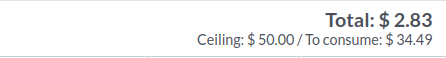
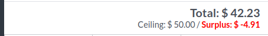
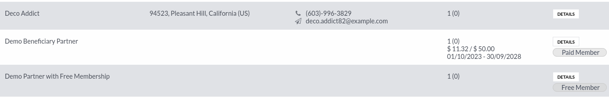
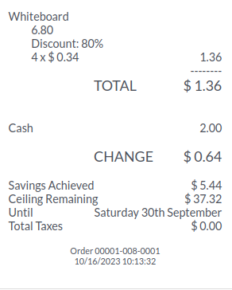

This module extends the functionality of point of sale module, to
add custom informations and features for the UGESS Project.

**On the order summary**

- It displays the ceiling and the remaining amount.

**On the customer list view**

- it displays the ceiling of each customer, with start of the
  the ceiling, and the current total of the period.

- it displays an household summary text.

**On the receipt**

- it replaces the "discount" word by "Savings Achieved"

- it displays ceiling and remaining amount

**Adds constrains**

- it prevents to make an order with normal products and
  membership products.
